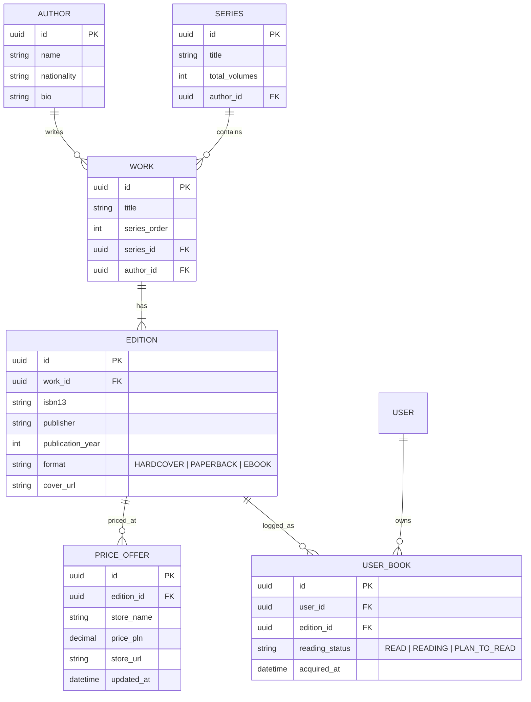

# 📚 TomeStack – The Series Completionist & Book Edition Tracker

[](LICENSE)
[](index.html)
[](#roadmap)
[](#-multilingual-support)

> **Never lose track of a series again.**  
> TomeStack is a modern personal book catalog and series completion tracker designed specifically for book collectors and avid readers. It tracks owned volumes, distinguishes between publisher editions and binding types (hardcover vs. paperback), uncovers missing tomes across your collections, compares real-time bookstore deals, and presents full author bibliographies.

*Read this document in Polish: [README.pl.md](README.pl.md) | Szczegóły architektury: [ARCHITEKTURA_I_TECHNOLOGIE.md](ARCHITEKTURA_I_TECHNOLOGIE.md)*

---

## 🎯 The Problem TomeStack Solves

Most book cataloging apps (like Goodreads or StoryGraph) are reading logs focused on social reviews and annual reading goals. They fail collectors who care about physical shelves and complete book series:

1. **Broken Series Tracking:** Standard platforms don't alert you when a new volume in a cycle is published or clearly visualize which exact books are missing from your series (e.g., owning books 1, 2, 4, 5 of an 8-book saga).
2. **Ignored Book Editions & Bindings:** Collectors care deeply about print formats—whether a book is Hardcover (`📖 Twarda`) or Paperback (`📕 Miękka`), the publisher imprint, and year of print.
3. **Scattered Author Bibliographies:** Finding an author's complete release order (including spin-offs, short-story anthologies, and side prequels) usually requires tedious cross-referencing between Wikipedia and Polish databases like LubimyCzytać or Biblioteka Narodowa.
4. **Bookstore Price Hunting:** When you identify a missing volume, checking prices across multiple retailers (Empik, Świat Książki, TaniaKsiążka, Allegro) is repetitive and time-consuming.

**TomeStack solves all of these in a single, unified experience.**

---

## ✨ Key Features

### 👤 1. Multi-User Authentication & Personal Shelves
* Every user has an independent, private bookshelf with their own collection statistics.
* **Instant Account Switcher:** Switch seamlessly between demo collector profiles (*Kamil* – fantasy enthusiast, *Anna* – classic literature collector, or *Guest* mode) to test different collection configurations.
* Completion rates and missing volume alerts recalculate instantly upon account switching.

### 📈 2. Series Completion Progress & Statistics
* Visual percentage progress bars for every saga (e.g., *The Witcher: 6/8 volumes [75%]*).
* Real-time indicators of owned vs. unowned volumes in canonical reading order.
* Global collection metrics: Total Volumes, Owned Volumes, Missing Volumes, and Average Series Completion Rate.

### 🎯 3. Missing Volumes Radar (Completionist Mode)
* A dedicated dashboard that aggregates every unowned volume across all your active series.
* Prioritize finishing sagas that are already 70%+ completed.
* Direct store action buttons to find and acquire missing books immediately.

### 📖 4. Edition Explorer & Format Filtering
* Filter your entire library or individual volumes by binding format:
  * **📖 Hardcover (`Twarda oprawa`)**
  * **📕 Paperback (`Miękka oprawa`)**
* Inspect precise edition metadata: Year of publication, Publisher, Translator, Page count, and ISBN-13.

### 💰 5. Live Bookstore Price Comparison
* Automated price aggregation across major Polish book retailers:
  * **Świat Książki**
  * **TaniaKsiążka.pl**
  * **Empik**
  * **Allegro**
* Highlights the cheapest available price with direct purchase links and binding badges.

### ✍️ 6. Full Author Bibliographies
* Click on any author name (e.g., *Andrzej Sapkowski*, *J.R.R. Tolkien*, *Frank Herbert*) to open a dedicated bibliography overlay.
* View all chronological cycles, standalone novels, companion guidebooks, and anthologies.
* Visual badge indicators showing which of the author's books you already own and what is left to explore.

### 📱 7. Barcode / ISBN Camera Scanner
* Fast, in-browser optical barcode scanning using mobile cameras (ZXing / html5-qrcode).
* Scan the back cover of any physical book in a bookstore or home library to instantly pull metadata and add it to your shelf.

### 🌐 8. Multilingual Support (PL / EN)
* One-click language switcher toggling the entire interface between Polish and English.

---

## 🖥️ Interactive Prototype Walkthrough

TomeStack includes a fully functioning, interactive single-page application prototype (`index.html`) demonstrating the complete design system and user experience.

### How to Run the Prototype Locally:
1. Clone this repository:
   ```bash
   git clone https://github.com/MatthiasLew/TomeStack.git
   cd TomeStack
   ```
2. Open [`index.html`](index.html) directly in any modern web browser:
   * **Windows (PowerShell):** `Start-Process index.html`
   * **macOS:** `open index.html`
   * **Linux:** `xdg-open index.html`
3. Try switching between demo users (*Kamil* vs *Anna* vs *Guest*), filtering by hardcover editions, clicking author names, and viewing missing volume purchase links.

---

## 🏗️ Production Architecture & Tech Stack

```
┌─────────────────────────────────────────────────────────────┐
│                      FRONTEND & PWA                         │
│   Next.js 14+ (App Router) + React + Tailwind CSS + Lucide  │
│   • In-browser camera ISBN barcode scanner (html5-qrcode)   │
│   • PWA support (installable on iOS & Android home screens) │
│   • Server-Side Rendering (SSR) for fast author & book SEO  │
└──────────────────────────────┬──────────────────────────────┘
                               │ (REST / Next.js Server Actions)
┌──────────────────────────────▼──────────────────────────────┐
│                    BACKEND & DATABASE                       │
│   Supabase (Managed PostgreSQL)                             │
│   • Relational schema: Works ➔ Editions ➔ User Shelf Items  │
│   • Row Level Security (RLS) ensuring strict user privacy   │
│   • Fast indexing on ISBN-10, ISBN-13, and Author EAN       │
└──────────────────────────────┬──────────────────────────────┘
                               │ (Metadata ingestion & price feeds)
┌──────────────────────────────▼──────────────────────────────┐
│               EXTERNAL APIS & INTEGRATIONS                  │
│   1. National Library of Poland API (data.bn.org.pl)        │
│      Official registry of all Polish ISBNs, covers & prints │
│   2. Google Books API & Open Library API (Global editions)  │
│   3. Price Aggregation Feeds (Ceneo API / Allegro REST)     │
└─────────────────────────────────────────────────────────────┘
```

### Relational Data Model (Core Entities)



---

## 🛠️ Developer Tooling & AI-Assisted Workflow

This project is integrated with specialized autonomous developer tooling:

* **[ai-dev-cli-tools](https://github.com/MatthiasLew/ai-dev-cli-tools):** Provides deterministic project scanning, context packaging, lightweight test validation, and telemetry tracking.
* **[freelance-dev-suite](https://github.com/MatthiasLew/freelance-dev-suite):** Manages project intake, scope boundaries, task verification, and automated quality gates.

### Running Project Checks
```bash
# Run deterministic scanner
ai-dev scan --project .

# Build compact context report for coding agents
ai-dev context build --project .
```

---

## 🗺️ Roadmap

- [x] **v0.1 – Conceptual Architecture & Plan:** Defined relational database model, Polish API sources (BN), and pricing aggregation architecture.
- [x] **v0.2 – Interactive Prototype (v2.2):** Built standalone Tailwind SPA prototype with multi-user simulation, missing radar, author bibliography modal, and bookstore comparison.
- [ ] **v1.0 – Next.js & Supabase Foundation:**
  - Initialize Next.js 14 App Router project with TypeScript & Tailwind CSS.
  - Set up Supabase PostgreSQL schemas with Row Level Security.
  - Supabase Auth (Email + Google OAuth).
- [ ] **v1.1 – Polish National Library (`data.bn.org.pl`) Ingestion:**
  - Automated lookup and cataloging by ISBN-13.
  - Fetching verified publication metadata and covers.
- [ ] **v1.2 – ISBN Barcode Scanner:**
  - Integrated mobile camera scanner in web browser.
- [ ] **v1.3 – Price Hunting Aggregator:**
  - Background cron jobs fetching live bookstore prices for unowned series items.
- [ ] **v2.0 – Community & Social Shelves:**
  - Shareable public shelf links with OpenGraph cards for Discord/Facebook.
  - Friend collection comparison (see what books your friends can lend you).

---

## 📄 License

This project is open-source under the [MIT License](LICENSE).
